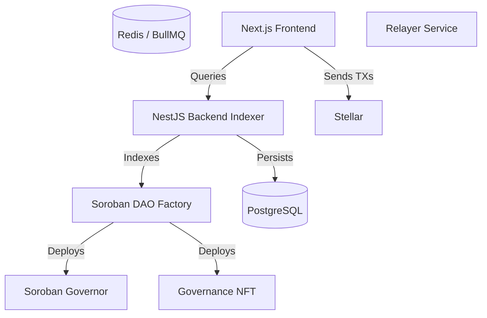

# Community Corner
A unified ecosystem for the Community Corner protocol.

## Architecture

The project consists of a complete decentralized application leveraging the Stellar blockchain for fast, low-cost operations, alongside a legacy EVM implementation.



## Stellar Implementation (Primary)

The core architecture operates on **Stellar**, with smart contracts written in **Soroban (Rust)**.

### Tech Stack
- **Smart Contracts:** Soroban, Rust
- **Backend:** NestJS, PostgreSQL (Prisma), Redis, BullMQ
- **Frontend:** Next.js, React, Tailwind CSS
- **Wallet Integration:** Freighter SDK (`@stellar/freighter-api`)

### Setup Instructions

#### 1. Smart Contracts
Navigate to `contracts-soroban/`.
```bash
cd contracts-soroban
cargo test
```

#### 2. Backend
Navigate to `backend/`.
```bash
cd backend
cp .env.example .env
docker-compose up -d
npm install
npx prisma generate
npx prisma migrate dev
npm run start:dev
```

#### 3. Frontend
Navigate to `frontend/`.
```bash
cd frontend
npm install
npm run dev
```

### DAO Lifecycle
1. **Create DAO**: A user submits a transaction via the Factory contract.
2. **Mint NFT**: Governance tokens are minted, distributing protocol shares.
3. **Proposals**: Users interact with the Governor contract to propose actions.
4. **Voting**: NFT holders cast weighted votes.
5. **Execution & Escrow**: Approved actions are executed, and escrow funds released.

## EVM Implementation (Paused)

The older version of Community Corner Factory targeting EVM-compatible networks is stored under `contracts-evm/`. It contains robust, highly-tested Foundry contracts representing the original architecture before the pivot to Stellar.

See `contracts-evm/README.md` for historical tests and architecture.

## Getting Started & Contributing
Check the individual components for specific test suites and operational guides. PRs should run tests for the respective components modified.
